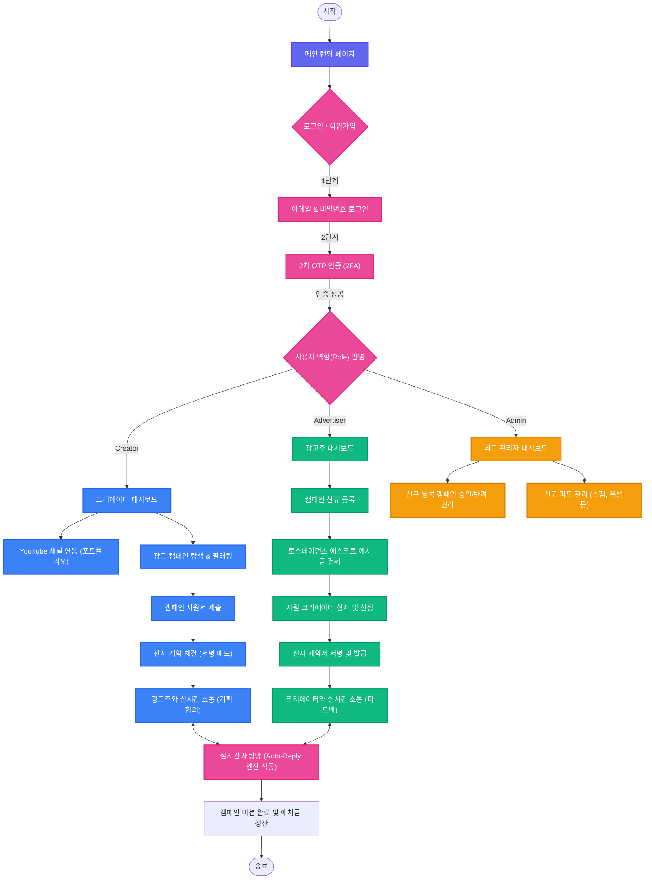

# 🤝 Ad-Connect (애드커넥트)
> **크리에이터와 광고주를 잇는 안전한 실시간 광고 매칭 및 에스크로 플랫폼**

Ad-Connect는 크리에이터(인플루언서)와 광고주 간의 투명하고 안전한 비즈니스 협업을 지원하는 플랫폼입니다. 포트폴리오 실시간 동기화, 전자 계약 체결, 에스크로 안전 결제 및 실시간 협의 시스템을 한 번에 제공합니다.

---

## 📅 개발 기간
* **2026.03.03 ~ 2026.05.22**

---

## 🛠️ 기술 스택 (Tech Stack)

### Frontend
| 기술 | 분류 | 상세 사용 목적 및 버전 |
| :--- | :--- | :--- |
|  | Library | 사용자 인터페이스 구축 (v19.2.6) |
|  | Build Tool | 고속 프런트엔드 개발 및 빌드 환경 구축 (v5.2.11) |
|  | Visualization | 광고 성과 분석 지표(조회수, CTR, CVR, ROI) 시각화 차트 구현 (v3.8.1) |
|  | Styling | 반응형 웹, 다크 모드 및 Glassmorphism 디자인 시스템 구현 |
|  | Icons | UI 컴포넌트 아이콘 셋 활용 |

### Backend
| 기술 | 분류 | 상세 사용 목적 및 버전 |
| :--- | :--- | :--- |
|  | Language | 백엔드 핵심 애플리케이션 개발 |
|  | Framework | RESTful API 서버 구축 및 웹 어플리케이션 환경 제공 (v3.2.5) |
|  | Messaging | STOMP 프로토콜을 사용한 양방향 실시간 채팅/알림 서버 기능 구현 |
|  | Security | 역할 기반 인가 및 엔드포인트 보안 제어 (웹소켓 연결 허용) |
|  | Authentication | JWT (jjwt v0.12.5) 기반 무상태 인증 체계 구축 |
|  | ORM | 데이터베이스 액세스 계층 추상화 및 Entity 제어 |
|  | Tool | 보일러플레이트 코드 제거 및 가독성 향상 |

### Database & Infrastructure
| 기술 | 분류 | 상세 사용 목적 및 버전 |
| :--- | :--- | :--- |
|  | Database | 빠른 테스트 및 QA용 메모리 데이터베이스 (h2-console 내장) |
|  | Database | 로컬 및 실제 영속성 관리를 위한 상용 데이터베이스 셋업 |
|  | Container | 백엔드 컨테이너 라이징 및 이식성 확보 (Gradle 멀티빌드 최적화) |
|  | Deploy | 프런트엔드 정적 호스팅 및 SPA 라우팅 대응 (`vercel.json` 셋업) |

---

## 🗺️ 웹 사이트 흐름도 (Website Flowchart)

사용자가 플랫폼에 진입하여 권한별 기능을 수행하는 전체 흐름입니다.



---

## 🌟 핵심 기능 (Key Features)

### 1. 2단계 보안 인증 (Multi-Factor Authentication)
* 이메일/비밀번호 인증 후, 이메일로 자동 전송되는 6자리 일회용 보안 비밀번호(OTP)를 통한 2차 검증 체계 구현.

### 2. 크리에이터 대시보드 & YouTube 연동
* YouTube API 연동 시뮬레이터를 기반으로 구독자 수, 평균 조회수, 캠페인 성공률 등의 지표를 실시간 동기화.
* Recharts를 활용하여 캠페인 별 노출 성과, 클릭률(CTR), 구매 전환율(CVR) 시각화 차트 제공.

### 3. 실시간 캠페인 검색 및 고급 필터링
* 구독자 조건(1만+, 5만+, 10만+), 예산 범위, 카테고리(게임, 요리, 테크 등)별 즉각 필터링 기능.
* 최근 등록 순, 높은 예산 순, 높은 성과 순 정렬 시스템.

### 4. 안전 에스크로 결제 (토스페이먼츠 연동 시뮬레이터)
* 광고 계약 체결 시 캠페인 예산을 안전하게 예치하기 위한 토스페이먼츠 연동 시뮬레이터 탑재.

### 5. 전자 계약 서명 시스템 (Canvas E-Signature)
* 브라우저 Canvas API를 활용한 정밀 터치/마우스 서명 패드 구현.
* SHA-256 서명값 해시 처리 및 보안 저장 프로세스 제공.

### 6. 실시간 협의 시스템 (WebSocket & Auto-Reply & REST Fallback)
* **양방향 실시간 STOMP 채팅**: 스프링 WebSocket 메시지 브로커를 활용하여 크리에이터와 광고주 간의 무지연 양방향 메시징 구현.
* **하이브리드 동기화 (REST API Fallback)**: 네트워크 연결이 해제되거나 방화벽 등으로 웹소켓 접속이 끊어질 경우, 자동으로 2초 주기 REST Polling 동기화로 복구 및 대체되는 장애 예방 메커니즘 제공.
* **1.5초 지연 오토 리플라이(Auto-Reply) 봇**: 백엔드 스레드를 통한 1.5초 지연 가상 타이핑 시뮬레이션을 구현하여 시나리오, 계약, 정산 등의 키워드 감지형 자동 피드백 응답 자동화.

---

## 📂 프로젝트 구조 (Directory Structure)

```
AdConnect/
├── .vscode/               # 에디터 설정
├── api/                   # API 관련 정의
├── backend/               # Spring Boot 백엔드 애플리케이션 (3계층 아키텍처 도입)
│   ├── src/main/java/     # Java 소스코드 (Controller, Service, Entity, Repository 구조)
│   │   └── com/adconnect/backend/
│   │       ├── config/    # Security 및 WebSocket STOMP 브로커 환경설정
│   │       ├── controller/# API 엔드포인트 및 WebSocket MessageMapping 수신 처리
│   │       ├── service/   # [NEW] 도메인 핵심 비즈니스 로직 및 트랜잭션 격리 계층
│   │       └── repository/# JPA 데이터 액세스 레이어
│   ├── src/main/resources/# 설정 파일 (application.yml - H2/MySQL 프로파일 전환 가능)
│   ├── Dockerfile         # 백엔드 컨테이너 빌드 파일
│   └── build.gradle       # Gradle 의존성 빌드 가이드 (spring-boot-starter-websocket 포함)
├── dist/                  # 빌드 산출물 폴더
├── public/                # 정적 리소스 파일
├── src/                   # React 프런트엔드 애플리케이션 (컴포넌트 구조 고도화)
│   ├── components/        # [NEW] 단일 책임으로 독립 분할된 리액트 컴포넌트 묶음
│   │   ├── auth/          # Landing, Login, Signup, OTP 2FA, Install 관련 뷰
│   │   ├── common/        # Toast, Sidebar, TopHeader 등 공통 UI 구성요소
│   │   └── dashboard, marketplace, portfolio, chat, contracts, admin, mypage/ # 기능별 전용 뷰
│   ├── utils/             # [NEW] 경량 native WebSocket STOMP 클라이언트 (stomp.js)
│   ├── App.jsx            # 상태 중재(State Orchestrator) 및 전체 네비게이션 라우터
│   ├── index.css          # 디자인 시스템 및 글로벌 Glassmorphism 스타일링 정의
│   └── main.jsx           # 리액트 마운팅 진입점
├── vercel.json            # Vercel SPA 서빙 구성 설정 파일
├── package.json           # 노드 패키지 정보
└── README.md              # 프로젝트 매뉴얼 가이드
```

---

## 🚀 로컬 실행 방법 (How to Run)

### Prerequisites
* Node.js v18 이상
* JDK 17 이상

### 의존성 설치 (Root Directory)
```bash
npm install
```

### 실행 옵션

#### 1. 프런트엔드 단독 실행 (Mock 데이터 모드)
```bash
npm run dev
```

#### 2. 백엔드 서버 단독 실행 (Java Spring Boot)
```bash
npm run dev:backend
```

#### 3. 프런트엔드 + 백엔드 전체 연동 동시 실행
```bash
npm run dev:all
```
> `dev:all` 스크립트는 `concurrently` 라이브러리를 통해 리액트 개발 서버와 스프링 부트 서버를 동시에 기동합니다.
